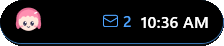
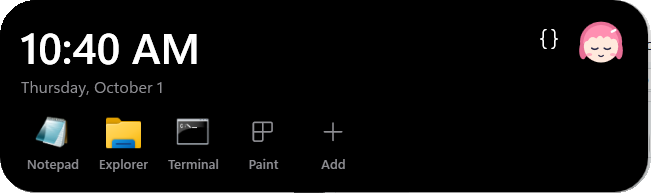
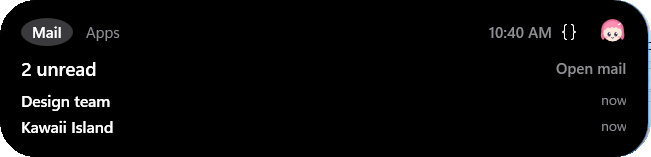

# Kawaii Island

A cute, customizable **Dynamic Island for Windows 11** (macOS version in progress). A small pill docks at the top of your screen and expands with springy micro-animations to show music, mail, notifications and app shortcuts. A mascot reacts to what you do.

<p align="center"></p>

<p align="center">
  <br><br>
  <br><br>
  
</p>

**It never covers your browser tabs.** The island reserves its own strip of screen as a Desktop AppBar, so maximized windows stop below it instead of sliding underneath.

> **Status: v0.1 feature-complete on Windows.** All 11 build phases (skeleton → polish), Code mode with on-island approvals, mail and app shortcuts are done; the macOS app and installers are next. See [Roadmap](#roadmap). Try the design in your browser: open [`design/mockup/index.html`](design/mockup/index.html).

## Features

- **AppBar workspace reservation** (top/bottom/left/right): windows stop below the island. The reservation is released cleanly on exit or crash.
- **Music from any player** via Windows media controls (SMTC): Spotify, Apple Music, browser tabs, VLC… with no login. The accent color comes from the album art.
- **Notifications mirroring** (toasts), **mail** headers over IMAP (unread count and latest 5; bodies are never downloaded), **app shortcuts** (drop a file on the island to pin it).
- **5 mascots** (Kiko, Miso the cat, Bun the bunny, Bolt the robot, Ribbit the frog). They blink, peek out to say hi when the island is hidden, squish when clicked, and get dizzy if you click three times fast.
- Drag to move, edge snapping, auto-hide in fullscreen, dark/light themes, tray icon.
- **Ctrl+Alt+I** opens and closes the island from anywhere (change it in Settings → Behavior). **Start with Windows** is on by default for installed builds.
- **Coding mode** (`</>` button on the island): the mascot puts on a hoodie and glasses, a lock-in timer runs, and alerts stop popping the island open.
- Follows the [design guidelines](#design-guidelines): glanceable, quiet by default, message text hidden until you allow previews, height that fits its content, honours Windows "Animation effects".
- **Code mode (Claude Code companion):** live status of your Claude Code sessions (thinking, which tool is running, needs your permission, done), plus context used, 5-hour and weekly plan usage with reset times, and session cost. See below.

## Code mode (Claude Code)

Turn it on from the tray: **Code mode (Claude Code)**. After you confirm, Kawaii Island adds a few entries to `~/.claude/settings.json` (a backup is saved as `settings.json.kawaii-backup`):

- **Hooks** for session, prompt, tool, notification and stop events. Each one is an `async` `curl` call to `http://127.0.0.1:47811/kawaii/hook`, so Claude Code never waits on them.
- **A permission hook** (synchronous) so you can answer **Allow / Deny** on the island. It waits up to 2 minutes, then hands the question back to the terminal; if the island isn't running it falls back immediately. Turn it off in Settings → Claude Code → *Approve from the island*. There's no helper program that could go missing, and if the island isn't running the call just fails quietly.
- **A status line**, but only if you don't already have one. It sends usage to the island and shows `🏝 ctx 23% · 5h 41% · wk 12%` in Claude Code. Plan usage (5-hour and weekly) comes from Claude Code's status line data, which is only available on Pro and Max plans.

Turning Code mode off, or uninstalling the app (`KawaiiIsland.exe --uninstall-hooks`), removes exactly those entries and nothing else. Restart open Claude Code sessions after you toggle it, because hooks load when a session starts. The listener only accepts connections from this PC, and session data is kept in memory only.

## Privacy: everything stays on your device

- No accounts, no cloud sync, no telemetry, no analytics.
- Settings: `%LOCALAPPDATA%\KawaiiIsland\config.json` (local, not roaming). macOS: `~/Library/Application Support/KawaiiIsland/`.
- Mail passwords are encrypted with Windows DPAPI (current user, this machine). On macOS they go in the login Keychain with iCloud sync disabled. They are never written to `config.json`.
- Mirrored notifications are kept in memory only (last 20) and disappear when the app quits. Only the names of apps you mute are saved.
- The only network traffic is to **your own mail server** if you turn on IMAP.

## Build & run (Windows)

Requirements: Windows 10 2004+ / Windows 11, [.NET 8 SDK](https://dotnet.microsoft.com/download/dotnet/8.0).

```powershell
cd windows
dotnet build
dotnet test
dotnet run --project src/KawaiiIsland
```

`--data <folder>` runs with a separate settings folder (handy for demos; the screenshots above use mock mail and notifications). Development builds never register themselves to start with Windows unless you turn it on in Settings.

**Logs:** `%LOCALAPPDATA%\KawaiiIsland\logs\yyyy-MM-dd.log` (last 7 days). They contain app events and errors only, never message contents or passwords.

## Design guidelines

The island follows Apple's Live Activities guidelines adapted to Windows: one glanceable thing at a time; compact, minimal (44 px circle on side docks) and expanded states; a thin key line tinted by the active content; medium-weight type; animations under a second that switch off with Windows "Animation effects"; sensitive text hidden by default; activities end promptly and every source can be turned off.

## Repository layout

| Path | What |
|---|---|
| `windows/` | WPF app (`src/KawaiiIsland`) + xUnit tests |
| `macos/` | Native Swift app (coming) |
| `design/` | Interactive mockup, design tokens, mascot source (`mascot/mascot.js`) and generators |
| `installer/` | Windows installer + macOS DMG packaging (coming) |

Mascot art has a single source: `design/mascot/mascot.js`. Regenerate the SVGs and the WPF `Mascots.xaml` with `node design/mascot/gen.mjs`, and the app icon with `node design/mascot/icons.mjs` (uses your installed Chrome in headless mode).

## Roadmap

- [x] 0 · Design mockup, repo
- [x] 1 · Skeleton: borderless topmost pill, tray icon, single instance, config service
- [x] 2 · Animations: expand/collapse spring, hover, mascot moods
- [x] 3 · Drag, snap, position persistence
- [x] 4 · AppBar workspace reservation (+ collapse-after timeout: 4 / 10 / 15 / 30 s / never)
- [x] Code mode: Claude Code companion (activity, context, 5-hour / weekly usage)
- [x] 5 · Settings window and right-click menu (live apply, dark/light/auto theme, accent, mascot picker)
- [x] 6 · Auto-hide in fullscreen and the mascot peek
- [x] 7 · Music (SMTC)
- [x] 8 · Notifications mirroring
- [x] 9 · Mail (demo inbox + IMAP with IDLE, DPAPI password)
- [x] 10 · Shortcuts (pinned apps, file-drop box, reorder, run as admin)
- [x] 11 · Polish: start with Windows, Ctrl+Alt+I hotkey, file logging, sleepy mascot, dynamic height, screenshots
- [ ] Installers: Windows setup `.exe` and macOS `.dmg` (built in GitHub Actions)

## Mail

Settings → Mail. The **Demo inbox** (default) shows sample messages so you can see how it looks. Pick **IMAP** and enter your server, username and an **app password** (Gmail and Outlook require one; OAuth isn't supported yet). Kawaii Island opens INBOX read-only, reads unread **headers only**, and waits for new mail with IMAP IDLE (or polls every `pollSeconds`). New mail updates the badge and makes the mascot hop; it never pops the island open. Subjects only show when *Show message previews* is on. Clicking opens webmail for Gmail/Outlook/Yahoo/iCloud servers, `openUrl` if you set one, or your default mail app.

## Known limitations

- **Notification mirroring and app identity.** Current Windows 11 builds let the unpackaged app read notifications once you allow it (Settings → Privacy & security → Notifications → *Let apps access your notifications*). Older builds only share them with apps that have package identity: install the MSIX build, or register a *sparse package* (an `AppxManifest.xml` with `uap10:AllowExternalContent`, signed, added with `Add-AppxPackage -ExternalLocation <install dir>`) so the plain `.exe` gets identity. Without access, Settings explains what to do and the rest of the island works normally. For demos, set `"modules": { "notifications": { "source": "mock" } }` in `config.json`.
- Builds aren't code-signed yet, so Windows SmartScreen and macOS Gatekeeper will warn on first launch.

## License

[MIT](LICENSE). The mascots are original characters made for this project.
